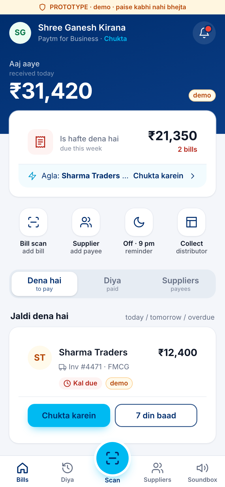
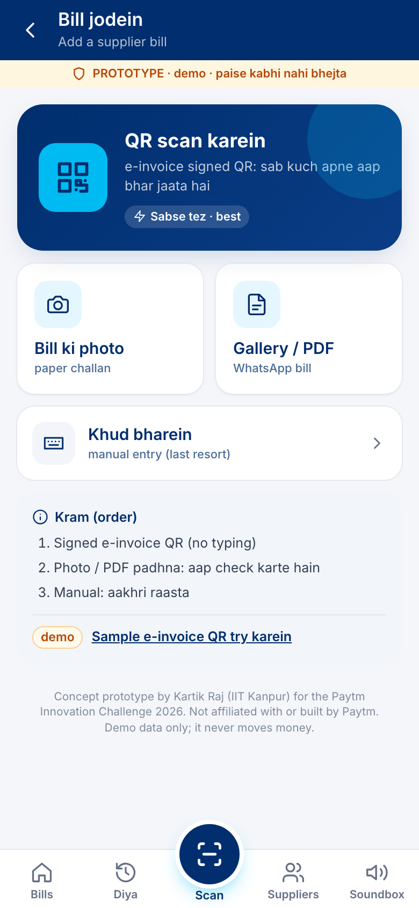
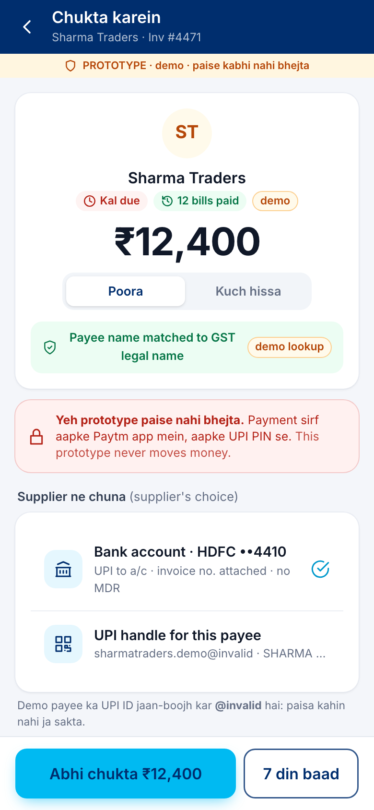
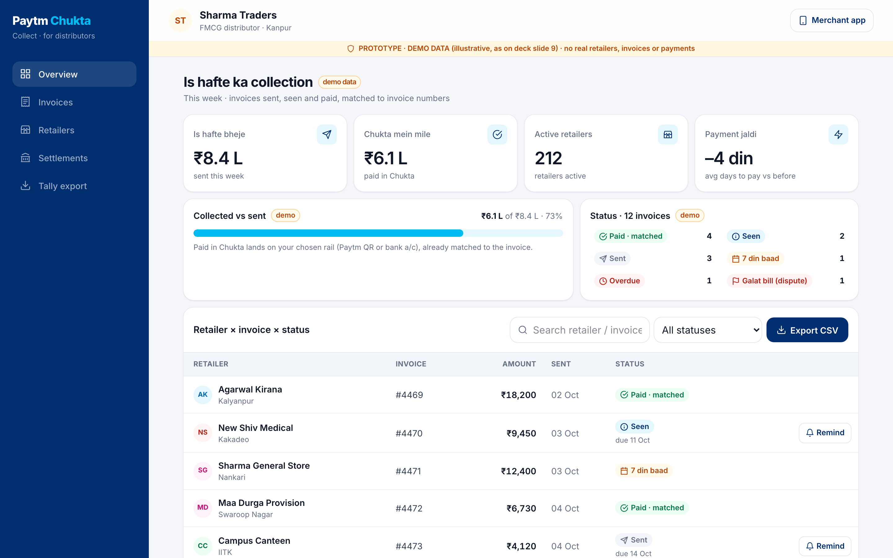

<div align="center">

# Paytm **Chukta**

### *"Paisa Paytm pe aata hai. Ab supplier ka bill bhi Paytm se chukta."*

Money already comes in on Paytm. Chukta makes the shop's stock bills go out on Paytm too.

[](https://chukta-r2-prototype.vercel.app)
&nbsp;


**Kartik Raj** · B.Tech, IIT Kanpur · individual entry · field research in Kanpur, Sep–Oct 2026

 &nbsp;
 &nbsp;


<sub>Real screens from the live prototype (demo data)</sub>

</div>

---

## The idea in one paragraph

1.57 Cr merchants receive money on a Paytm Soundbox or QR, yet their largest outgoing payment, the **supplier stock bill**, leaves through PhonePe, Google Pay or cash. Chukta puts a **supplier-bill inbox** inside Paytm for Business, next to the money that already lands there. Bills arrive by distributor push, signed e-invoice QR or a photo. The **Soundbox reminds at 9 pm** what is due tomorrow. The owner **pays in one tap** with their own Paytm UPI PIN, and the payee name is checked against the supplier's GST legal name. Short on cash? **"7 din baad"**: the supplier is paid today through a partner bank's credit line on UPI. Distributors get **Chukta Collect**, a free view of who paid which invoice.

<p align="center"><br><sub>Chukta Collect, the distributor view (demo data)</sub></p>

## Round 2 at a glance

| | Result | How it was measured |
|---|---|---|
| 🧑‍💼 Interviewed | **21 shop owners + 4 distributors** | Kanpur, 8 Oct 2026, voice notes |
| 💡 Found it useful | **20 / 21** rated 4–5 | concept board, scale 1–5 |
| 💸 Would pay next supplier bill via Paytm | **7 / 21 (33%)** · bar ≥ 30% | *stated* commitment (ladder L3) |
| 📝 Want to join the 90-day pilot | **13 / 21** | stated (L4) |
| 🚚 Distributors agreeing to join the pilot | **2 / 4** · bar ≥ 2 | verbal, non-binding |
| 📱 Pay suppliers from the owner's personal phone | **21 / 21** · median **4 min** per payment | screener |

All Round 2 answers are **stated, not observed**: nobody used the prototype during interviews and no payments were watched. Prototype usability and real payments are tested in pilot weeks 1–2 (see the deck, slides 6–7).

## What's in this repository

```
.
├── chukta_handoff/            ← SOURCE OF TRUTH for the submission
│   ├── Chukta_R2_kit/         deck source (Jinja2 + HTML), business model, build scripts
│   │   └── out/               KartikRaj_R2.pdf · KartikRaj_R2_Annexure.xlsx
│   ├── r2_validation_log.csv  21 shop interviews (anonymised: area + shop type only)
│   └── distributor_log.csv    4 distributor interviews
├── prototype/                 clickable web prototype (Vite + React + Tailwind) → Vercel
├── fieldkit/                  print-ready A4 field kit (concept board, interview script, tracker)
├── submission/                the two files uploaded for Round 2
└── submission_check.py        rebuilds submission/ and runs the final checklist
```

| Folder | Start here |
|---|---|
| Deck and workbook | [`chukta_handoff/Chukta_R2_kit/README.md`](chukta_handoff/Chukta_R2_kit/README.md) |
| Prototype | [`prototype/README.md`](prototype/README.md) · research notes in [`prototype/NOTES.md`](prototype/NOTES.md) |
| Field kit | [`fieldkit/README.md`](fieldkit/README.md) |

## Quick start

```bash
# 1. Deck → out/KartikRaj_R2.pdf (needs Carlito + Noto Color Emoji fonts installed)
python3 -m venv .venv && .venv/bin/pip install jinja2 openpyxl playwright pillow
.venv/bin/python -m playwright install chromium
cd chukta_handoff/Chukta_R2_kit && ../../.venv/bin/python build.py --png

# 2. Prototype on http://localhost:5173
cd prototype && npm install && npm run dev
```

## Built on rails that exist today

| Rail | Used for | Status in the prototype |
|---|---|---|
| UPI push intent (`upi://pay`) | "Abhi chukta" opens the owner's UPI app | ✅ real, but NPCI blocks intent to personal / non-verified payees, so the fallback is *scan the supplier's QR in Paytm* |
| GST e-invoice signed QR (IRP JWT) | bill capture without typing | ✅ decoded on the phone; signature check labelled demo |
| tesseract.js (Hindi + English) | photo / PDF bill reading | ✅ runs on the phone, owner confirms every field |
| Web Speech API (hi-IN) | Soundbox reminder simulator | ✅ |
| UPI collect requests | — | ❌ never used: P2P collect ended 1 Oct 2025 |

Sources and quotes from the NPCI circulars are in [`prototype/NOTES.md`](prototype/NOTES.md).

---

<sub>Concept prototype by Kartik Raj (IIT Kanpur) for the Paytm Innovation Challenge 2026. **Not affiliated with or built by Paytm.** "Paytm" and "Soundbox" are trademarks of their owner and are used only to describe the concept. The prototype uses demo data and never moves money.</sub>
